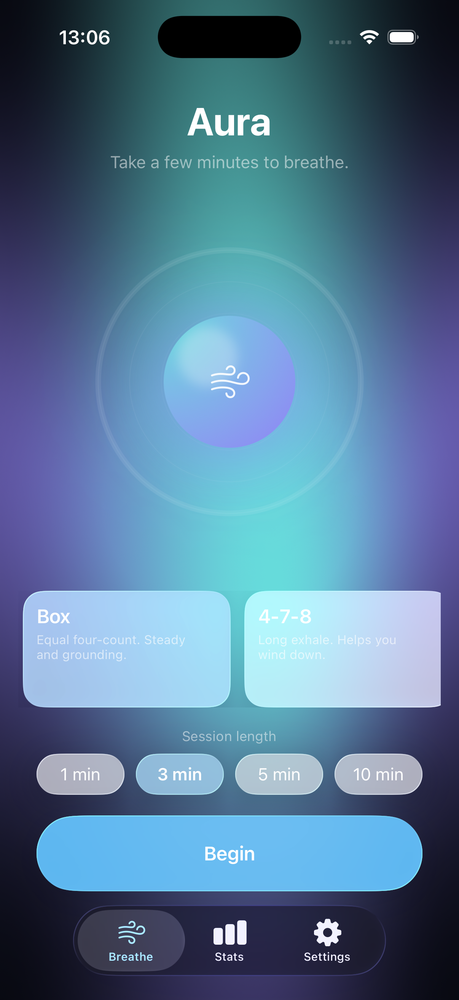

# Aura

A calm, native iOS breathing app. Pick a technique, follow the orb as it grows and
settles, and build a daily streak. Built in SwiftUI with a focus on motion, feel,
and a clean, testable core.

> Made by Arseniy Cherednichenko.

<p align="center">
  
</p>

## Features

- **iOS 26 design** — a living `MeshGradient` aurora that breathes behind the UI, and **Liquid Glass** controls and cards throughout.
- **Guided breathing** with six techniques — Box, 4-7-8, Calm, Energize, Coherent, and Deep.
- **Animated breath orb** that scales in time with each phase, over an ambient
  drifting-gradient background. Phase changes are reinforced with soft haptics.
- **Sessions, streaks, and stats** — every session is saved with SwiftData; the
  Stats tab shows your current streak, total time, session count, and a
  seven-day Swift Charts bar chart, and the Breathe screen greets you with today's
  minutes and streak.
- **Thoughtful settings** — session length, default pattern, haptics, keep-screen-awake,
  Light/Dark/System appearance, and a confirm-gated reset for your history.
- **Onboarding**, empty states, and **Reduce Motion** support throughout.

## Architecture

The timing logic is deliberately separated from the UI so it can be unit-tested:

```
Aura/
  Engine/BreathEngine.swift     # pure, deterministic breath state machine
  Models/                       # BreathPattern + BreathingSession (SwiftData)
  Stats/Stats.swift             # streak + aggregation, all pure functions
  Stores/Settings.swift         # @AppStorage keys + Appearance
  Theme/ • Support/             # colours, gradients, haptics, formatters
  Views/                        # Breathe, Stats, Settings, Onboarding
AuraTests/                      # 17 unit tests over the engine, streak, stats
```

`BreathEngine` advances purely via `tick(_:)`, and the stats/streak functions
operate on plain `SessionRecord` values, so the whole core runs without any UI
or database.

## Build

The project is generated with [XcodeGen](https://github.com/yonsm/XcodeGen) from
`project.yml` (no checked-in pbxproj churn to read through):

```bash
brew install xcodegen
xcodegen generate
open Aura.xcodeproj
```

Requires Xcode 26+ and iOS 26+ (Liquid Glass, animated `MeshGradient`, SwiftData, Swift Charts).

## Tests

```bash
xcodebuild -project Aura.xcodeproj -scheme Aura \
  -destination 'platform=iOS Simulator,name=iPhone 17' test
```

17 tests covering phase progression, session completion, multi-phase ticks,
zero-length-step filtering, streak edges (no sessions, today-only, gaps, stale),
and stat aggregation.
